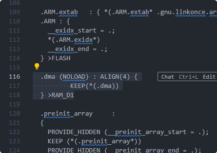

# Custom_Changes After Code Regeneration

1. DMA_NORMAL To DMA_CIRCULAR

2. DMA_FIFOMODE_DISABLE

3. STM32H750VBTx_FLASH.ld


```c
.dma (NOLOAD) : ALIGN(4) {
        KEEP(*(.dma))
  } >RAM_D1
```

添加在图片下面位置.ARM段后面
